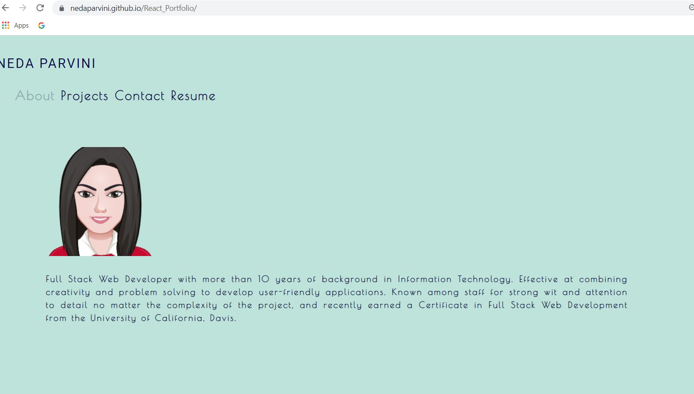

# React Portfolio

Using React to create Portfolio application. 

## Description

This app has four different parts (menu) which are:
About us, Portfolio, Contact and Resume. 
Portfolio shows Projects with picture samples, name and GitHub links.

## Usage

npm start and GitHub Pages

## Technologies

REACT

JavaScript

HTML

CSS

Coolors

## Preview

 

## Link: 

GitHub Page: https://nedaparvini.github.io/React_Portfolio/
